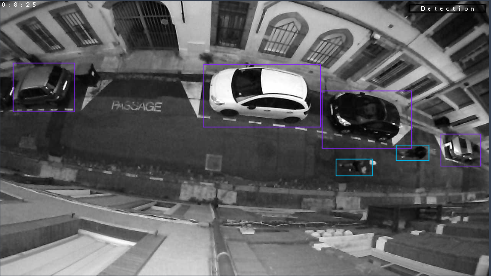

# 🚀 Occion
### [🔗 Official Website](https://www.occion.fr)

**Occion** is a start-up based in Gaillac-Brens, France, focused on developing innovative electronic solutions. During my 4-month internship, I was recruited as a *stagiaire* to work on improving the detection algorithm for a sensor designed to classify public road actors, such as pedestrians, cars, motorcycles, bicycles, and more, using a camera and image data analysis.

---

## 🎯 Project Overview

The goal of the project was to enhance the accuracy and robustness of the sensor's detection algorithm. The sensor is an **embedded system**, meaning the algorithm had to run locally without relying on cloud processing. Here's how the project evolved:

### Initial Approach
The initial algorithm used a **decision tree** based on differences between consecutive frames. Parameters such as object size, elongation, density, and curvature were used to define thresholds for classifying each type of actor. However, this method only achieved an accuracy of **55%**, which was not robust enough for real-world applications.

---

## 🛠️ My Role and Contributions

As the lead developer for this algorithm, I proposed and implemented a **supervised learning approach** to improve its performance. Here's a breakdown of my work:

### 1. **Data Collection**
I began by collecting a substantial dataset of road actors. This involved manually creating a table where each object was described by its characteristics. For example:

| Object       | Area  | Elongation | Density | Curvature | ... |
|--------------|-------|------------|---------|-----------|-----|
| Car          | 4500  | 75         | 80      | 20        | ... |
| Pedestrian   | 850   | 90         | 90      | 0         | ... |
| Motorcycle   | 1200  | 85         | 70      | 15        | ... |
| Bicycle      | 600   | 80         | 60      | 10        | ... |

This table represented each object as a vector based on pixel differences between frames caused by their movement, 2000 objects were registered.

### 2. **Model Training**
Using this dataset, I trained and compared several supervised learning algorithms. The **Random Forest** model emerged as the best performer, achieving an accuracy of **85%**—a significant improvement over the initial decision tree.

### 3. **Data Annotation for Future Improvements**
To further enhance the algorithm, I collected and labeled a dataset of **5,000 images** featuring various road actors. I used **Roboflow**, an open-source platform, to manage and version these images in the cloud. This dataset laid the groundwork for future implementations of **deep learning models** to achieve even higher performance.

---

## 🖼️ Example Image

Here’s an example of the labeled images used for training:

---

## 🚀 Results and Impact

By the end of my internship, I had successfully:
- Improved the algorithm's accuracy from **55% to 85%** using Random Forest.
- Created a robust dataset of **5,000 labeled images** for future deep learning implementations.
- Set the stage for transitioning to more advanced models, such as convolutional neural networks (CNNs), to further enhance performance.

---

## 🌟 Key Takeaways

This internship allowed me to:
- Gain hands-on experience in **machine learning** and **embedded systems**.
- Develop skills in **data collection**, **model training**, and **performance optimization**.
- Work in a collaborative environment to solve real-world problems.

---

### 📌 Tags
#Engineering #MachineLearning #EmbeddedSystems #ComputerVision #Internship #Occion