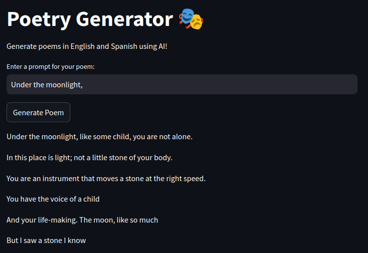

# 🖋️ GenAI Poetry: An AI Writing Poetry

We are currently living in a technological and computational revolution. Artificial intelligence models have become a key tool in our daily lives, enhancing productivity and even serving as a source of recreation. 

As a poetry lover, I wanted to combine these two passions: the ancient art of poetry and the cutting-edge technology of AI. This project was born out of my desire to find inspiration for writing my own poetry. 😊

In this post, I'll walk you through the stages of the project, from data acquisition to web deployment. I'll keep it concise and not too technical—this is more of a personal recount than a step-by-step manual. Enjoy!


Don't forget to check out the repository for more technical details: [🔗 GenAI Project](https://github.com/jgarnicaa/GenAI_Poetry)


## 📂 Data Acquisition

To train the model, I needed a large dataset of poems in both English and Spanish. For English, I found a suitable dataset on Kaggle. However, for Spanish, the available datasets were either too small or incomplete. So, I decided to scrape a poetry website to gather my own dataset. You can read more about the web scraping process in my [Web Scraping blog post](#).

In the end, I had:
- **14,000 poems in English**
- **13,000 poems in Spanish**

---

## 🧹 Data Cleaning

Having the data was just the first step. Ensuring its quality was crucial. I faced several questions during this phase:
- Should I clean spaces and line breaks?
- Should I remove stopwords?
- How should I normalize the data?

To answer these questions, I focused on the final product I wanted to deliver: a model that generates a poem based on a prompt (the first line) and produces up to 200 words in a single stanza, with proper line breaks for aesthetic appeal.

The cleaning process involved:
- Normalizing line breaks.
- Dropping excessively long or short poems.
- Ensuring the final output had the necessary line breaks for readability.

---

## 🤖 Model Selection and Training

I chose **GPT-2** for fine-tuning because it is lightweight, easy to fine-tune, and deployable without requiring extensive computational resources. Since my hardware was limited, I used **Google Colab** for training, leveraging the **Hugging Face** library to load the pre-trained GPT-2 model and fine-tune it with my dataset. The training process took approximately **7 hours**.

---

## 🚀 Model Deployment

I wanted the model to be accessible to everyone, so I decided to deploy it as a web application. Here's how I did it:
1. **Backend**: Built with **FastAPI**.
2. **Frontend**: Developed using **Streamlit**.
3. **Containerization**: Packaged the application into a Docker container.
4. **Deployment**: Used **AWS EC2** to host the application, making it publicly accessible.

---

## 📊 Results

The results were promising! The model generates coherent and creative poems based on the input prompt. However, there was a minor issue: the model sometimes mixed English and Spanish in the output. This happened because I didn't add a language tag during data preprocessing. Regenerating the poem with the same prompt usually fixed the issue.

Here's an example of a poem generated in English:

---

## 🌟 Conclusion

This project was a fascinating journey into the intersection of art and technology. By combining my love for poetry with the power of AI, I created a tool that can inspire and generate beautiful poems. While there are still improvements to be made, the results are already impressive.

If you're interested in exploring the project further, check out the [GitHub repository](https://github.com/jgarnicaa/GenAI_Poetry) and try out the web application!

---

### 📌 Tags
#LLM #GenAI #Poetry #MachineLearning #WebDeployment #GPT2 #HuggingFace